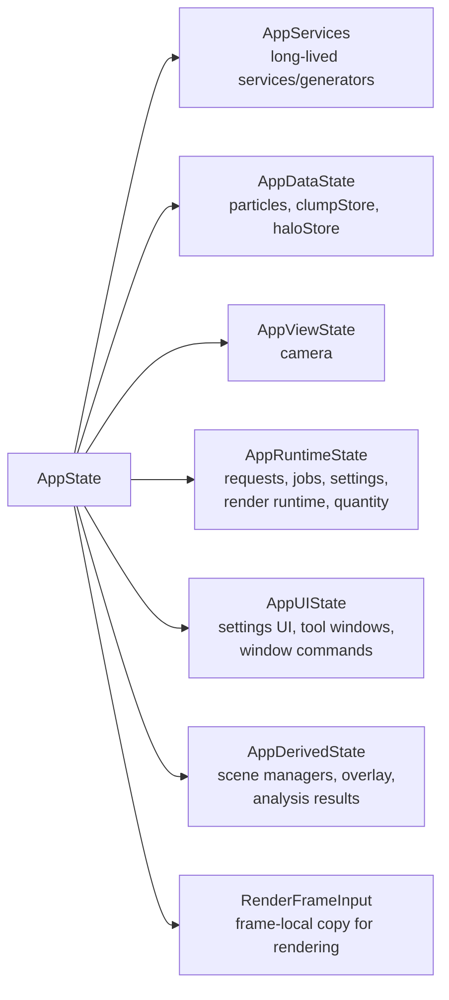
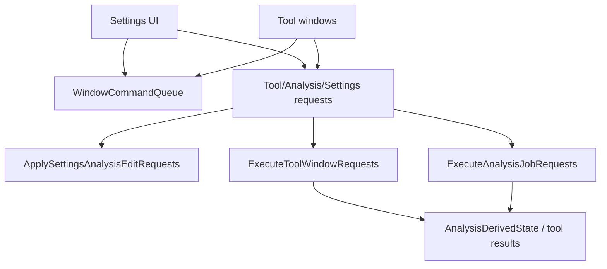
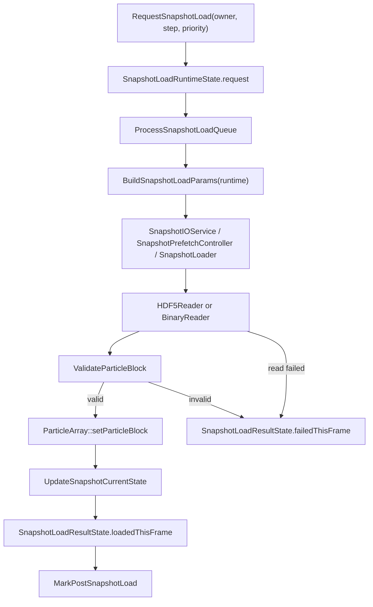
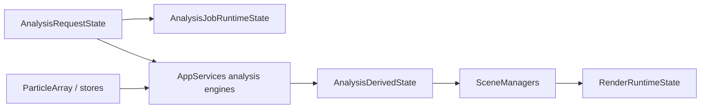
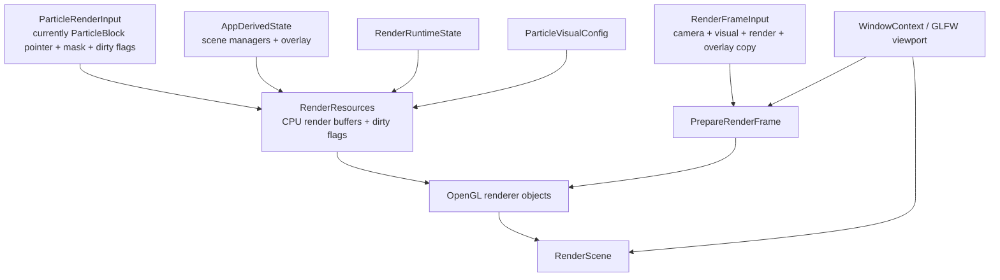
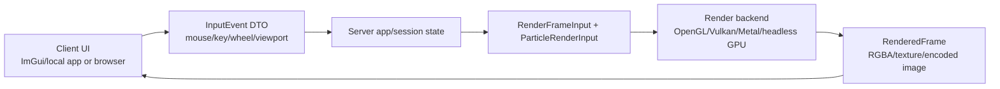

# Code Flow Map

This document maps the current runtime flow and the major ownership boundaries.
It is intended as a working map for renderer abstraction, remote GPU rendering,
and future dependency cleanup.

## Top-Level Frame Flow

`RunFrame` in `src/app/app_frame.cpp` is the main orchestration point.

```mermaid
flowchart TD
  Begin["BeginFrame(runtime, window)"]
  MainUI["DrawMainUI(view, runtime, derived.analysis, ui.settings, windowCommands)"]
  OpenReq["ExecuteSettingsWindowOpenRequests"]
  ApplyWin1["ApplyWindowCommands"]
  PreviewTex["UpdateProjectionPreviewTexture"]
  ToolUI["DrawToolWindows(runtime, ui.toolWindows, windowCommands, analysis results, previewUI)"]
  ApplyWin2["ApplyWindowCommands"]
  External["UpdateExternalInputs(services, particles)"]
  Load["ProcessSnapshotLoadQueue(data, runtime, services)"]
  PostLoad["ExecutePostSnapshotLoadPhase(data, runtime, camera)"]
  ApplySettings["ApplySettingsAnalysisEditRequests"]
  Execute["ExecuteRequests(data, runtime, derived.analysis, ui.toolWindows, services, camera)"]
  Derived["RebuildDerivedState(particles, camera, derived, renderRuntime, projectionTool)"]
  Invalidate["ApplyDerivedRenderInvalidation"]
  AckDerived["AcknowledgeDerivedRebuild"]
  RenderInput["MakeParticleRenderInput(particles)"]
  Upload["UpdateRenderResources(particleInput, particleVisual, renderRuntime, derived, renderSystem)"]
  AckUpload["AcknowledgeParticleRenderUploads"]
  FrameInput["UpdateRenderFrameInput"]
  Prepare["PrepareRenderFrame(renderFrameInput, renderSystem, window)"]
  Render["RenderScene(renderSystem, window)"]
  End["EndFrame(window)"]

  Begin --> MainUI --> OpenReq --> ApplyWin1 --> PreviewTex --> ToolUI --> ApplyWin2
  ApplyWin2 --> External --> Load --> PostLoad --> ApplySettings --> Execute
  Execute --> Derived --> Invalidate --> AckDerived --> RenderInput --> Upload
  Upload --> AckUpload --> FrameInput --> Prepare --> Render --> End
```

## State Ownership

Current intent:

- `Data` owns loaded domain data.
- `Runtime` owns mutable app control state, requests, jobs, settings, and render settings.
- `UI` owns immediate UI/window state and window commands.
- `Derived` owns data generated from `Data + Runtime` for display or analysis results.
- `Services` owns long-lived implementation objects such as snapshot I/O, projection map generator, clump tools, and analysis engines.
- `RenderSystem` is currently OpenGL-oriented and lives outside `AppState`.

## UI To Execution Flow

UI should not run heavy work directly. It should edit UI state and emit requests.

Remaining cleanup target:

- `ToolWindowExecutionInput` structs still pass large data/service bundles.
- Next step is to split these into smaller executor-specific DTOs, starting with projection.

## Snapshot Load Flow

Important current guarantees:

- Failed load rolls navigation back.
- Invalid particle data is not committed.
- Batch/movie executors can detect owner/step-specific load failure.
- HDF5 reader no longer leaks units/comoving flags from the previously loaded file when `/Parameters` is missing.

## Analysis And Derived Flow

Main split:

- Analysis execution produces `AnalysisDerivedState`.
- `RebuildDerivedState` turns analysis/data into scene managers and overlay state.
- `ApplyDerivedRenderInvalidation` tells render runtime which CPU/GPU resources need update.

## Render Flow

Current backend coupling:

- `RenderSystem` owns OpenGL programs, resources, object renderers, and preview texture.
- `RenderFrameInput` is a useful DTO, but still copies app-facing types.
- `ParticleRenderInput` is frame-local, but still points to `ParticleBlock` and `TrackingVector`.

## Remote GPU / Backend Abstraction Map

Remote interactive rendering requires three boundaries, not just one renderer interface.

Required future DTOs:

- `InputEvent`: pointer, wheel, key, modifiers, viewport size.
- `RenderFrameInput`: backend-facing frame settings with no GLFW/ImGui dependency.
- `ParticleRenderInput`: spans, handles, or dataset/revision IDs instead of `ParticleBlock*`.
- `RenderedFrame`: image/texture handle/encoded frame that can be displayed locally or streamed.

## Recommended Next Refactor Steps

1. Make `ParticleRenderInput` backend DTO-like:
   - replace `ParticleBlock*` with spans or explicit particle/mask views
   - keep dirty/revision information outside renderer internals

2. Introduce `InputEvent`:
   - translate GLFW/ImGui mouse state into app input events
   - feed camera/projection interactions from this DTO

3. Narrow projection tool execution:
   - split `ProjectionToolExecutionInput` into request-specific DTOs
   - keep `ProjectionMapGenerator` behind execution, not UI

4. Create an OpenGL backend facade:
   - keep existing implementation
   - define the public calls the app is allowed to make
   - move toward `OpenGLRenderBackend` only after DTOs stabilize

5. Add a headless/offscreen frame path:
   - required for remote GPU rendering
   - enables server-side rendered image streaming later

## Current Hotspots

- `src/app/app_frame.cpp`: orchestration is much cleaner, but still central.
- `src/app/app_tool_window_dispatch.h`: execution inputs remain broad.
- `src/render/render_system.h`: OpenGL-oriented backend state is still the concrete render system.
- `src/render/render_resources.h`: render DTO boundary is improving but not backend-neutral yet.
- `src/UI/tool_window_ui.cpp`: projection UI is mostly request-based but still complex.

